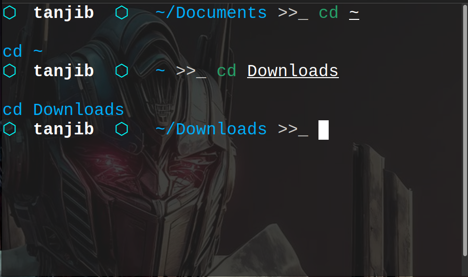

# trios — ZSH Theme

<p align="center">
  
</p>

<p align="center">
  <a href="https://github.com/ohmyzsh/ohmyzsh"></a>
  
  
</p>

A minimal cyberpunk shell prompt. Clean two-segment layout — username and path separated by hexagon bullets — with a colour-coded command echo on every keystroke: **cyan** for success, **red** for error.

---

## Design

```
⬡ tanjib  ⬡  ~/Documents/trios_rust/trios_terminal_rust >>_ cd ..
cd ..
⬡ tanjib  ⬡  ~/Documents/trios_rust >>_ cd ..
cd ..
⬡ tanjib  ⬡  ~/Documents >>_ cd..
cd..
/bin/bash: line 1: cd..: command not found
⬡ tanjib  ⬡  ~/Documents >>_ cd ..
cd ..
⬡ tanjib  ⬡  ~ >>_ ls
ls
10.48.141.132.gnmap
10.48.141.132.nmap
10.48.141.132.xml
AllForOne
```

| Element | Colour | Notes |
|---------|--------|-------|
| `⬡` hexagon bullets | Cyan | Separates prompt segments |
| Username | White bold | `%n` |
| Path | Cyan | Abbreviated `%~` |
| `>>_` arrow | White | Input cursor marker |
| Command echo (success) | **Cyan** | Printed via `preexec` hook |
| Command echo (error) | **Red** | When previous exit code ≠ 0 |

---

## Requirements

- **Zsh** ≥ 5.0
- **[Oh My Zsh](https://ohmyz.sh/)**
- Any monospace terminal font (no Nerd Font needed — uses `⬡` Unicode)

---

## Installation

## Installation

### Step 1 — Install Oh My Zsh (skip if already installed)

```bash
sh -c "$(curl -fsSL https://raw.githubusercontent.com/ohmyzsh/ohmyzsh/master/tools/install.sh)"
```

### Step 2 — Clone the repo

```bash
git clone https://github.com/MrEchoFi/trios-zsh-theme.git \
  ~/.oh-my-zsh/custom/themes/trios
```

### Step 3 — Copy the theme file

```bash
cp ~/.oh-my-zsh/custom/themes/trios/trios.zsh-theme \
   ~/.oh-my-zsh/custom/themes/
```

### Step 4 — Set the theme

Open your `.zshrc`:

```bash
nano ~/.zshrc
```

Find the line `ZSH_THEME=` and change it to:

```bash
ZSH_THEME="trios"
```

Save with **Ctrl+O → Enter → Ctrl+X**

### Step 5 — Reload

```bash
source ~/.zshrc
```

Your prompt should now look exactly like the preview above.

---
---

## Customisation

Add any of these to `~/.zshrc` **before** `source $ZSH/oh-my-zsh.sh`:

```bash
# Hexagon symbol (default: ⬡)
TRIOS_HEX="⬡"          # outline hexagon (default)
TRIOS_HEX="⬢"          # filled hexagon
TRIOS_HEX="*"          # plain ASCII fallback

# Colours — use a name or a 256-colour code
TRIOS_COLOR_HEX="39"        # ⬡ bullets and path  (default: electric blue)
TRIOS_COLOR_USER="white"    # username            (default: white)
TRIOS_COLOR_ARROW="white"   # >>_ arrow           (default: white)
TRIOS_COLOR_CMD_OK="39"     # command echo on success (default: electric blue)
TRIOS_COLOR_CMD_FAIL="red"  # command echo on error   (default: red)
```

## Troubleshooting

**`[oh-my-zsh] theme 'trios' not found`**

The `.zsh-theme` file is not in the right place. Run Step 3 again:
```bash
cp ~/.oh-my-zsh/custom/themes/trios/trios.zsh-theme \
   ~/.oh-my-zsh/custom/themes/
```
Then verify it exists:
```bash
ls ~/.oh-my-zsh/custom/themes/ | grep trios
```

---
## Terminal background

The screenshot uses a dark background with a cyberpunk armour wallpaper.
Recommended terminal settings:

- Background: `#0a0c0f` (near-black)
- Opacity: ~85% (lets wallpaper show through)
- Font: `JetBrains Mono`, `Hack`, or `Fira Code` at 13–14pt

---

## License

[MIT](LICENSE) © MrEchoFi
